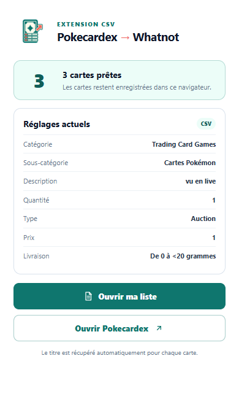
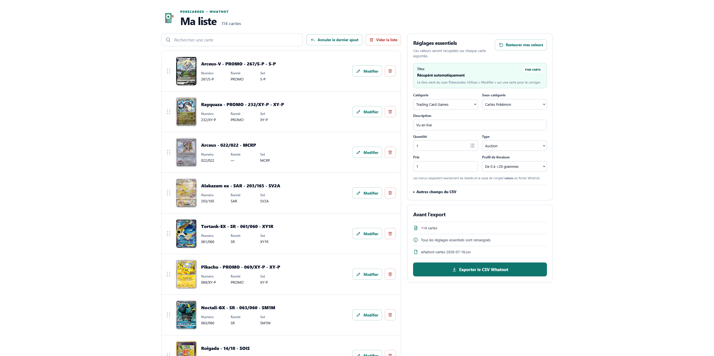

# Pokecardex → Whatnot

Extension de navigateur locale pour ajouter des cartes depuis Pokecardex, préparer une liste, puis exporter un CSV compatible avec Whatnot.



## Télécharger et installer

Les fichiers prêts à installer sont dans le dossier [`release`](release/).

### Chrome et Edge

1. Téléchargez [`extension-chrome-edge.zip`](release/extension-chrome-edge.zip) et extrayez-le dans un dossier.
2. Ouvrez `chrome://extensions` dans Chrome, ou `edge://extensions` dans Edge.
3. Activez le **Mode développeur**.
4. Cliquez sur **Charger l’extension non empaquetée** et choisissez le dossier extrait, celui qui contient `manifest.json`.

### Firefox

1. Téléchargez [`extension-firefox-signed.xpi`](release/extension-firefox-signed.xpi).
2. Ouvrez le fichier avec Firefox et acceptez l’installation.

Le fichier est signé pour Firefox et correspond à la version 1.1.0.

## Utilisation

1. Ouvrez une carte sur [Pokecardex](https://www.pokecardex.com/).
2. Cliquez sur **Ajouter à ma liste**.
3. Cliquez sur l’icône de l’extension, puis sur **Ouvrir ma liste**.
4. Vérifiez les réglages essentiels et cliquez sur **Exporter le CSV Whatnot**.

Le titre est récupéré automatiquement pour chaque carte. Il peut être corrigé avec le bouton **Modifier** présent sur chaque ligne.

## Une liste prête pour Whatnot



Le CSV généré **remplace le CSV Bulk de Whatnot** : il est prêt à être importé à la place du modèle Bulk rempli manuellement. La liste permet de relire les cartes, modifier un titre et appliquer les réglages essentiels avant l’export.

## Réglages Whatnot par défaut

| Champ | Valeur initiale |
| --- | --- |
| Catégorie | `Trading Card Games` |
| Sous-catégorie | `Cartes Pokémon` |
| Titre | Récupéré depuis Pokecardex, par carte |
| Description | `vu en live` |
| Quantité | `1` |
| Type | `Auction` |
| Prix | `1` |
| Profil de livraison | `De 0 à <20 grammes` |

Les menus de catégorie, sous-catégorie, état et livraison reprennent les valeurs exactes du modèle Whatnot. Les autres colonnes restent accessibles dans **Autres champs du CSV**.

## Confidentialité

Les cartes ajoutées et les réglages CSV restent uniquement dans le stockage local du navigateur. L’extension n’utilise aucun compte, serveur ou token.

## Contenu du dépôt

- `src/` : code source de l’extension.
- `release/` : paquets d’installation et guide HTML.
- `docs/screenshots/` : aperçu de l’interface.
- `tests/` : tests de l’export, du stockage et du manifeste.

## Développement

```powershell
npm install
npm run package
npm run smoke:browsers
```

Le guide visuel est aussi disponible dans [`release/GUIDE-INSTALLATION.html`](release/GUIDE-INSTALLATION.html).
